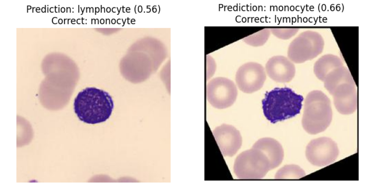
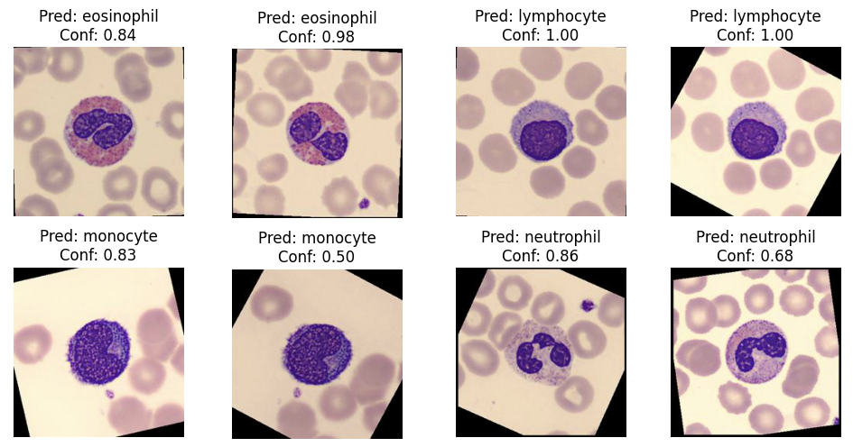

# White Blood Cell Classifier

A deep learning model to classify 4 types of white blood cells: eosinophil, lymphocyte, monocyte, and neutrophil.

## Model Results

### Side-by-Side Comparison

### Prediction Results

## Project Overview

This project implements a convolutional neural network (CNN) to automatically classify different types of white blood cells from microscopic images. The model can distinguish between four main types of white blood cells, which is crucial for medical diagnosis and blood analysis.
